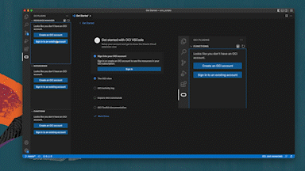

# OCI Toolkit for VS Code

OCI Toolkit for VS Code is a rich collection of OCI extensions, making it easier for you to develop, test, and deploy applications on Oracle Cloud Infrastructure (OCI) straight from VS Code.

<!-- region exclude-from-marketplace -->
OCI toolkit for VS Code is available from the [Visual Studio Marketplace](https://marketplace.visualstudio.com/items?itemName=Oracle.oci-vscode-toolkit)

<!-- endregion exclude-from-marketplace -->

## OCI Services

- **Resource Manager** extension allows you to edit, plan and deploy Resource Manager Configurations stored in Object Storage or a Code repository. For more information, see the [Resource Manager Walkthrough](https://docs.cloud.oracle.com/iaas/Content/ResourceManager/Tasks/vscode.htm)
- **Functions** extension in the VS Code lets you create a new function, edit an existing function and deploy and invoke it. For more information, see the [Functions Walkthrough](https://docs.oracle.com/iaas/Content/Functions/Tasks/functionscreatingfunctions-usingVScodeplugin.htm)
- **Data Science** extension allows you to edit your job artifacts and run Data Science jobs natively. For more information, see the [Data Science Walkthrough](https://docs.oracle.com/en-us/iaas/data-science/using/vscode.htm)
- **OCI CLI** allows users to perform common platform actions, such as creating and managing OCI resources using the built-in OCI CLI in the VS Code terminal
- **Application Performance Monitoring** extension allows you to manage APM Availability Monitoring scripts, monitors under APM domains within VS Code. For more information, see the [Application Performance Monitoring Walkthrough](https://docs.oracle.com/en-us/iaas/application-performance-monitoring/home.htm)

    

## Installation

Installing the OCI VS Code toolkit installs all of the extensions along with the [OCI Core extension](https://marketplace.visualstudio.com/items?itemName=Oracle.oci-core)

You can easily uninstall individual extensions if you are not interested in using them, without affecting other extensions provided by this pack. Additionally, you can uninstall all of the extensions by uninstalling the OCI VS Code toolkit extension.

## Minimum policies required
Allow group <groupname> to inspect compartments in tenancy

## Sign-In

The plugin requires basic configuration information, like user credentials and tenancy OCID.
This information should be present in a configuration file located at `~/.oci/config`

There are two ways to get the config file

1. Auto-generate file using Sign In Button:

    On successful login, a config file will be generated and saved in `~/.oci` folder
    
2. Manually generate a file and save it in the `~/.oci` folder:

    Details on generating the configuration file can be found [here](https://docs.oracle.com/en-us/iaas/Content/API/Concepts/apisigningkey.htm#apisigningkey_topic_How_to_Generate_an_API_Signing_Key_Console)

    

## Switch-Region

The user can switch to different subscribed OCI regions from this wizard.
  

## OCI CLI

The OCI Toolkit for VS Code comes with the OCI CLI.  Users can effortlessly perform common platform actions, such as creating and managing OCI resources using the built-in OCI CLI in the VS Code terminal. Further, leverage the [OCI CLI's interactive mode](https://blogs.oracle.com/cloud-infrastructure/post/announcing-interactive-mode-for-oracle-cloud-infrastructure-command-line-interface) to simplify resource management tasks with command and parameter suggestions, auto-completing, and command reference information.

Enable interactive mode on your terminal with the below command from the Command Palette:
```
Toggle Interactive CLI
```

## Documentation

Full documentation, including prerequisites, supported vscode versions and configuration instructions, is available [here](https://docs.oracle.com/iaas/Content/API/SDKDocs/vscode_plugins_intro.htm).

## Contributing

This project welcomes contributions from the community. Before submitting a pull request, please [review our contribution guide](./CONTRIBUTING.md)

## Security

Please consult the [security guide](./SECURITY.md) for our responsible security vulnerability disclosure process

## License

Copyright (c) 2022, 2024, Oracle and/or its affiliates. All rights reserved.This software is licensed to you under the Universal Permissive License (UPL) 1.0 as shown at https://oss.oracle.com/licenses/upl.

See LICENSE for more details.