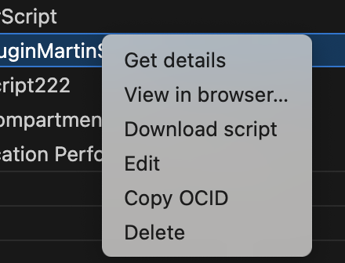
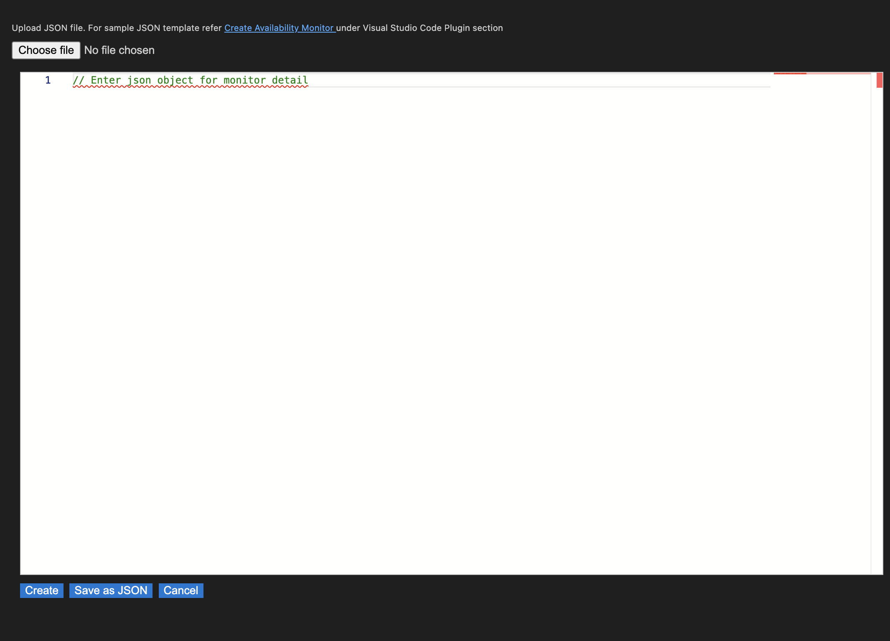

# Application Performance Monitoring service Plugin for Visual Studio Code

Use the OCI Application Performance Monitoring plugin to manage APM Availability Monitoring scripts, monitors under APM domains within VS Code.

**Checkout the [wiki](https://docs.oracle.com/en-us/iaas/application-performance-monitoring/home.htm) for more information about the APM service.**

## Installation

The plugin requires basic configuration information, like user credentials and tenancy OCID.
This information should be present in a configuration file located at `~/.oci/config`

There are two ways to get the config file

1. Manually generate a file and save in `~/.oci` folder:

    Details on the generating the configuration file can be found here : https://docs.oracle.com/en-us/iaas/Content/API/Concepts/apisigningkey.htm#apisigningkey_topic_How_to_Generate_an_API_Signing_Key_Console

2. Auto generate file using Sign In Button:

    On successfull login, a config file will be generated and saved in `~/.oci` folder
    
    

## Inital View

The Application Performance Monitoring plugin when loaded has a tree view in the side panel, the data is loaded based on the configuration information, like user credentials, region, tenancy OCID, etc in the configuration file

  

Hierarchy of tree view: the tree view has tenancy at the top level followed by compartments, each compartment has APM domains associated with the compartment. Each APM domain lists the Availability monitors, scripts. 

## Create Script 

The plugin provides the ability to create new Availability scripts.
Below are the steps:

- Expand APM Domains, select required domain 
- Right click on the Scripts option and click on `Create`
  
  
- Choose script type between Selenium SIDE script or Playwright typescript 
  
- Add script name, and select script file. Refer **https://docs.oracle.com/en-us/iaas/application-performance-monitoring/doc/create-script.html** for script inputs.  

## View Script Details

- Right click on script to view its details and click on `Get details`

   

## View Script in Browser 

- Right click on script to be viewed in browser and click on `View in browser...`

## Download Script 

- Right click on script to be downloaded and click on `Download script`

    

## Edit Script 

- Right click on script to be edited, either update values in file editor or upload updated script and click on `Edit`
   

## Copy Script OCID  

- Right click on script and click on `Copy OCID`  

## Delete Script

The plugin provides an option to delete Availability scripts.
Below are the steps:

- Right click on script to be deleted and click on `Delete`

  
- Select 'yes' from the prompt

  

## List Vantage Points

- Expand APM Domains, select required domain 
- Right click on the Monitors option and click on `List vantage points`
- Copy `name` param of the vantage point which will be used in create monitor command.

   

## Create Availability Monitors

The plugin provides the abililty to create new Availability monitors.
Prerequisite: Script is already created (to create script refer Create Script  section) and list of Vantage Points are available (to get list of vantage points refer List Vantage Points  section).
Below are the steps:

- Expand APM Domains, select required domain 
- Right click on the Monitors option and click on `Create`
  
  
- Upload existing JSON file or use template to create.
    

- Click on 
  - `Create` to create monitor.
  - `Save as JSON` button to save input values as JSON file and use this file later to create monitor(s)

## View Monitor Details

- Right click on monitor to view its details and click on `Get Details`

   

## View Availability Monitor in Browser 

- Right click on monitor to be viewed in browser and click on `View in browser...`
  
     

## Edit Availability Monitor 

- Right click on monitor to be edited and update values.

  
- Click on 
  - `Edit` to edit monitor.
  - `Save as JSON` button to save input values as JSON file and use this file later to create monitor(s)  

## Run Now Monitor 

- Right click on monitor for run now execution and click on `Run Now`

   

## Copy Monitor OCID  

- Right click on monitor and click on `Copy OCID`

## View Monitor Execution Results 

- Right click on monitor, expand `Execution results`, select `Get execution results` 

    

## View Error Message

- Right click on monitor, expand `Execution results`, select `View error message`

## View HAR, Screenshots

- Right click on monitor, expand `Execution results`, select `View execution HAR`  or `View execution screenshots`.
- It will prompt for timestamp, enter its value (get this value from the output of `Get execution results` command), then select vantage point for which you want to view the result.
- To download the results, `Download` button can be clicked.
- Select location to download file, this will download the file on the local system.

## Download Logs 

- Right click on monitor, expand `Execution results`, select `Download execution logs`. 
- It will prompt for timestamp, enter its value (get this value from the output of `Get execution results` command), then select vantage point for which you want to download the result.
- Select location to download file, this will download the file on the local system.

## Delete Availability Monitor 

The plugin provides an option to delete Availability monitor.
Below are the steps:

- Right click on monitor to be deleted and click on `Delete`

   
- Select 'yes' from the prompt
  
  

   
## Contributing

This project welcomes contributions from the community. Before submitting a pull request, please review our contribution guide.

## License

Copyright (c) 2025, Oracle and/or its affiliates. All rights reserved. This software is licensed to you under the Universal Permissive License (UPL) 1.0 as shown at https://oss.oracle.com/licenses/upl. 

See LICENSE for more details.