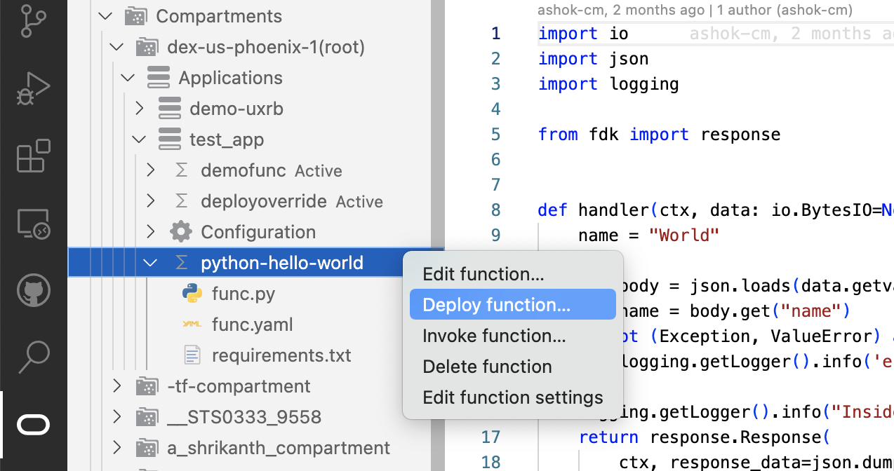
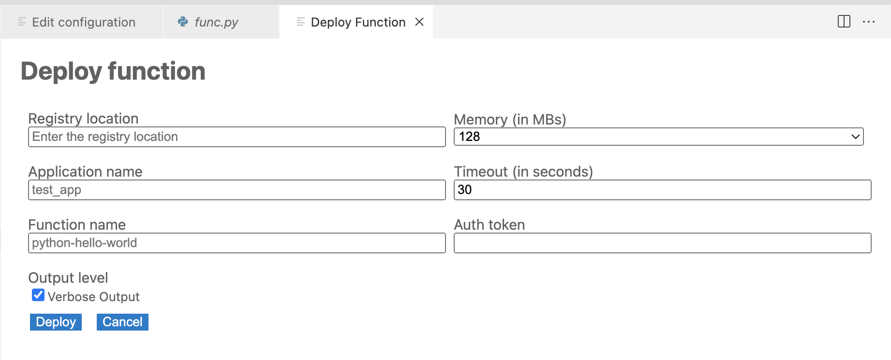
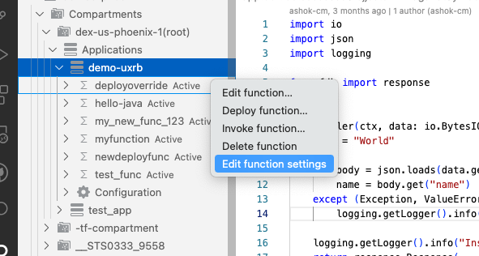

# Functions service Plugin for Visual Studio Code

Use the Functions plugin to view, create, deploy and invoke functions directly from VS Code.

**Checkout the [wiki](https://docs.oracle.com/en-us/iaas/Content/Functions/home.htm) for more information about the Functions service.**

## Installation

The plugin requires basic configuration information, like user credentials and tenancy OCID.
This information should be present in a configuration file located at `~/.oci/config`

There are two ways to get the config file

1. Manually generate a file and save in `~/.oci` folder:

    Details on the generating the configuration file can be found here : https://docs.oracle.com/en-us/iaas/Content/API/Concepts/apisigningkey.htm#apisigningkey_topic_How_to_Generate_an_API_Signing_Key_Console

2. Auto generate file using Sign In Button:

    On successfull login, a config file will be generated and saved in `~/.oci` folder
    
    

## Inital View

The Functions plugin when loaded has a tree view in the side panel, the data is loaded based on the configuration information, like user credentials, region, tenancy OCID, etc in the configuration file

  

Hierarchy of tree view: the tree view has tenancy at the top level followed by compartments, each compartment has appplications associated with the compartment. Each application lists the functions. 

## Creating Functions

The plugin provides the abililty to create new functions.
Below are the steps:

- Right click on the app created and click on `Create function...`
  
  

There are three options to create a function:

1. Create from Template: 

- Choose `Create from a template` from top option drop down. 

- Select a template from the list of templates and the repo will be visible in the tree view

2. Create from Sample:  Select from a list of samples

- Choose `Create from a sample` from top option drop down. 

- Select a sample from the list of samples and the repo will be visible in the tree view

3. Create from code repository

- Choose `Create from a code repository` from top option drop down.

  

- Enter function name as `python-hello-world`

- Enter Git URL as `https://github.com/ashok-cm/oci-function-python-hello-world`.

- Now you may see the code in the VSCode Editor.

  

## Deploy Function

A newly created function can be easily deployed.

Prerequisite: Please make sure you have [docker](https://docs.docker.com/engine/install/) & [fn cli](https://docs.oracle.com/en-us/iaas/Content/Functions/Tasks/functionsinstallfncli.htm) installed on your local machine.

Below are the steps:

- Click on `Deploy Function` on the function context menu.
  
  
- If authentication was done using the `Auto generated OCI Config file through Sign In Button` as shown in [Installation](#installation) section then the OCI config file needs to be manually updated by adding a `user` field. Users will be notified regarding this as shown below:

  
- Fill in deploy form as below
  
  
  Fill `Registry Location` as your preferred OCI image registry name. (eg. `python-hello-world`)
  Fill `Auth token` with OCI generated auth token.

## Edit Function Settings

The plugin provides an option to update the `Timeout` & `Memory` of a function.
Below are the steps:

- Click on `Edit function settings` on the function context menu.
  
  
- Enter the desired value and click `Update`
  
  

## Edit Function Configuration

A function can have user-defined config parameters / env variables. The plugin provides the ability to add/delete/update these parameters:

1. Click on the `Configuration` item under a function to open the page to interact with the config parameters for a function
   
   
2. The page provides a form to add new config and also lists any exiting config paramter in a table view
3. Edit existing config: Click on the `pen` icon to start editing an existing config, click on `check` button to confirm the change or `cross` button to cancel the change.
   
   
4. Add new config: Use the form to add new key/value pairs, fill the form and click on the `plus` button
   
   
5. Save all the changes by clicking the `Save` button
   
   

## Contributing

This project welcomes contributions from the community. Before submitting a pull request, please review our contribution guide.

## License

Copyright (c) 2023, Oracle and/or its affiliates. All rights reserved. This software is dual-licensed to you under the Universal Permissive License (UPL) 1.0 as shown at https://oss.oracle.com/licenses/upl or Apache License 2.0 as shown at http://www.apache.org/licenses/LICENSE-2.0. You may choose either license.

See LICENSE for more details.