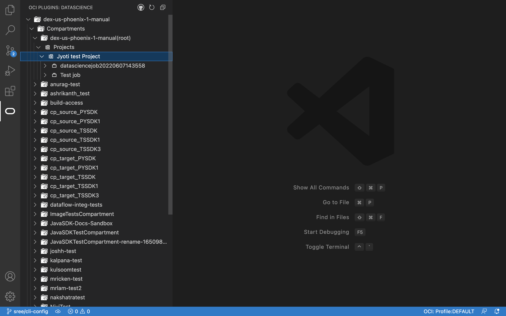
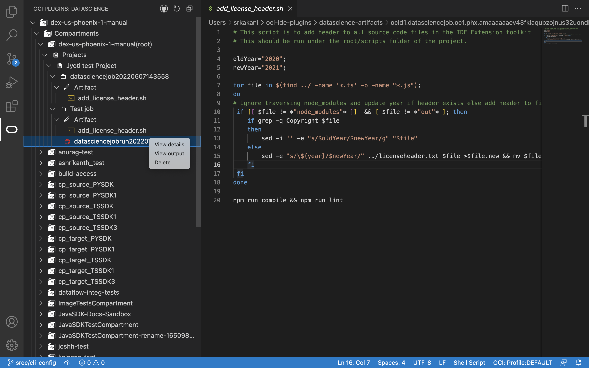
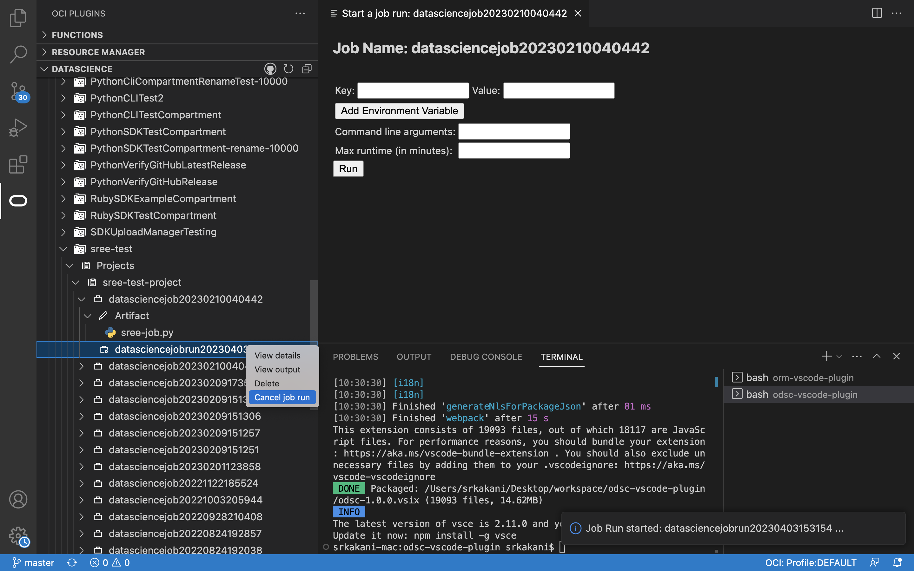
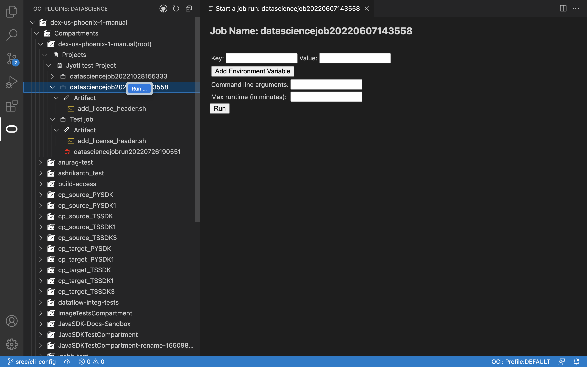
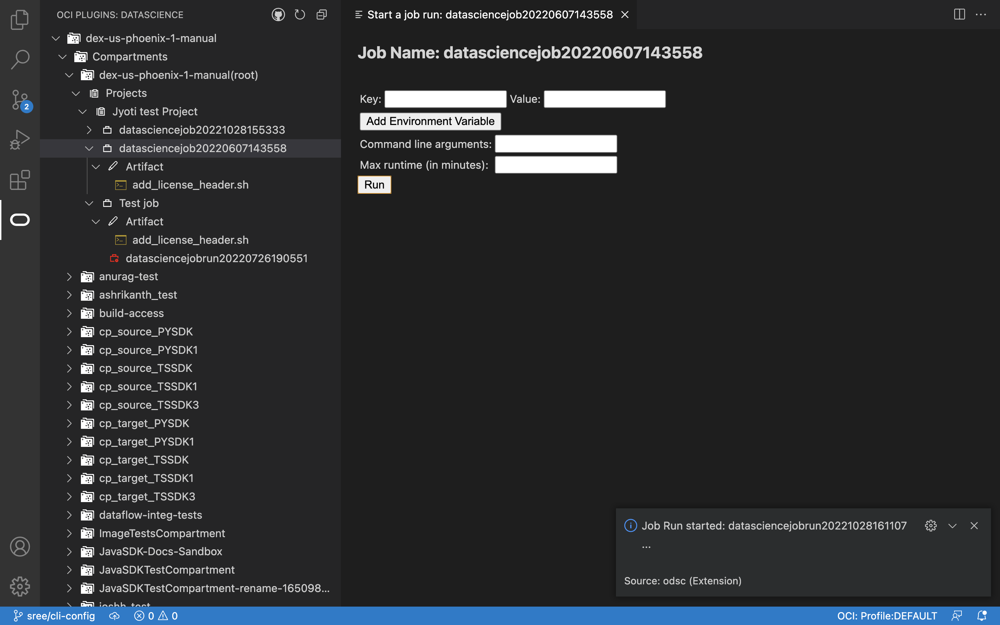

# Data Science service Plugin for Visual Studio Code

Oracle Data Science Service Jobs enables you to define and run a repeatable task on a fully managed infrastructure. The service enables custom tasks, as you can apply any use case you may have such as data preparation, model training, hyperparameter tuning, batch inference, etc.

Using jobs, you can:

* Run Machine Learning or Data Science tasks outside of your notebooks (JupyterLab)
* Operationalize discrete data science and machine learning tasks as reusable executable operation
* Automate your typical MLOps or CI/CD Process
* Execute batches or workloads triggered by events or actions
* Batch Inference, Mini-Batch or Distributed Batch Jobs

**Checkout the [wiki](https://docs.oracle.com/en-us/iaas/data-science/using/overview.htm) for more information about the Data Science service.**

## Installation

The plugin requires basic configuration information, like user credentials and tenancy OCID.
This information should be present in a configuration file located at `~/.oci/config`

There are two ways to get the config file

1. Manually generate a file and save in `~/.oci` folder:

    Details on the generating the configuration file can be found here : https://docs.oracle.com/en-us/iaas/Content/API/Concepts/apisigningkey.htm#apisigningkey_topic_How_to_Generate_an_API_Signing_Key_Console

2. Auto generate file using Sign In Button:

    On successfull login, a config file will be generated and saved in `~/.oci` folder
    
    

## Inital View

The Data Science plugin when loaded has a tree view in the side panel, the data is loaded based on the configuration information, like user credentials, region, tenancy OCID, etc in the configuration file

   

Hierarchy of tree view: the tree view has tenancy at the top level followed by compartments, each compartment has Projects associated with the compartment. Each Project lists the Jobs, each job lists the artifacts and all the job runs associated with it.

## Creating a new Job

The user can create a new job from an existing artifact
- Right click on the artifact node you wish to create a job from and click on `Create new job from artifact`

  

- The new job id will be displayed in a popup, on the bottom right corner
- The newly created job will appear on top in the tree view

## Get job artifact and override local changes

This option lets user revert any local changes by overriding with latest available on remote
- Right click on the artifact node and click on `Get job artifact and override local changes`

  

- The local changes (if any) would be overridden.

## View Details

View the job details
- Right click on a job run and click `View Details`

  

- There will be a redirection to the details page on the OCI console.

## View output

View the output of a job run
- Right click on a job run and click `View Details`

  

- The output would be printed in the `Output` window in bottom panel

## Cancel Job Run

Cancels an existing job run which is running
- Right click on a job run and click `Cancel job run`

   

- The cancel notification will be displayed on bottom right

   

## Delete Job Run

Deletes an existing job run. 
- Right click on a job run and click `Delete`

  
- A dialog to confirm the deletion will be shown on bottom right corner. Confirm to delete or cancel.

  

- Clicking on Delete will delete the job run associated with the Job

## Execute Data Science Job

- To execute the job from Code Editor, click on `Run` from job context menu as below. Fill in run form details as required. For this sample script nothing is required. Click on `Run`.

  

- This would trigger the job. You can now view the job logs from either OCI console or Code Editor with below options.

  

## Contributing

This project welcomes contributions from the community. Before submitting a pull request, please review our contribution guide.

## License

Copyright © 2023, Oracle and/or its affiliates. This software is dual-licensed to you under the Universal Permissive License (UPL) 1.0 as shown at https://oss.oracle.com/licenses/upl or Apache License 2.0 as shown at http://www.apache.org/licenses/LICENSE-2.0. You may choose either license.

See LICENSE for more details.