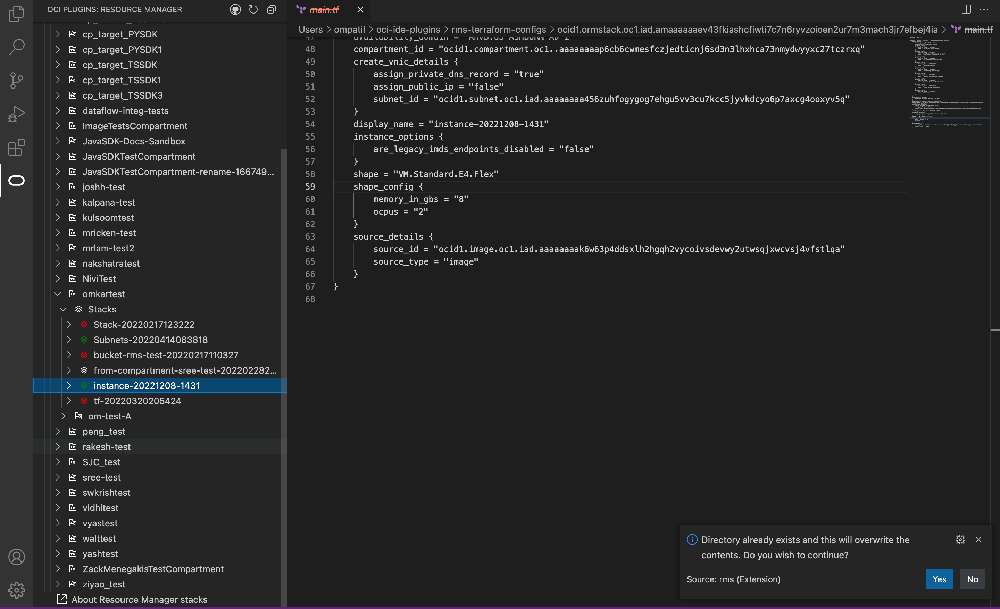

# Resource Manager Plugin (RMS) for Visual Studio Code

Resource Manager is an Oracle Cloud Infrastructure service that allows you to automate the process of provisioning your Oracle Cloud Infrastructure resources. Using Terraform, Resource Manager helps you install, configure, and manage resources through the "infrastructure-as-code" model.

**Checkout the [wiki](https://docs.oracle.com/en-us/iaas/Content/ResourceManager/Concepts/resourcemanager.htm) for more information about the Resource Manager service.**

## Installation

The plugin requires basic configuration information, like user credentials and tenancy OCID.
This information should be present in a configuration file located at `~/.oci/config`

There are two ways to get the config file

1. Manually generate a file and save in `~/.oci` folder:

    Details on the generating the configuration file can be found here : https://docs.oracle.com/en-us/iaas/Content/API/Concepts/apisigningkey.htm#apisigningkey_topic_How_to_Generate_an_API_Signing_Key_Console

2. Auto generate file using Sign In Button:

    On successful login, a config file will be generated and saved in `~/.oci` folder

     
    

## Inital View

The RMS plugin when loaded has a tree view in the side panel, the data is loaded based on the configuration information, like user credentials, region, tenancy OCID, etc in the configuration file

   

Hierarchy of tree view: the tree view has tenancy at the top level followed by compartements, each compartment has stacks associated with the compartment. Each stack lists the terraform config files. 

The Plugin provides operations for git-based and non-git based stacks

## Git-based stack
### Save stack

1. Right click on a stack, click on `Save changes` from the menu

  
  

2. A modal prompt informing user to use command line and push code to GitHub repo is shown. Please use the command line to push the code to GitHub:

  

### Run Plan job

Runs plan job & provisions resources as per edited terraform config and updates tooltip and icon based on whether plan was successful. Also, logs are shown regardless of failure or successful in output channel.

Below are the steps:

1. Right click on a stack, click on `Run Plan action on stack` from the menu:

  
  
2. The status is shown in notification on bottom right corner:

  

### Run Apply job

Runs apply job & provisions resources as per edited terraform config and updates tooltip and icon based on whether plan was successful. Also, logs are shown regardless of failure or successful in output channel. 

Below are the steps:

1. Right click on a stack, click on `Run Apply action on stack` from the menu:

  

2. The status is shown in notification on bottom right corner:

 
  
### Download configuration

Downloads terraform configuration depending on the source from which it was created ie: git, object storage or RMS

1. Right click on a stack, click on `Download configuration` from the menu:

  
  
2. A dialog for git URL will appear, enter the git url

  

2. A dialog for password will appear, enter the git user password

  

The repository will be cloned

## Non-Git based stack

The non git based stack has all the same options, the only difference is it cascades any changes to the service before running plan/apply action.
The menu options for non git based stack are as shown below:

  

### Download configuration

Provides ability to clone a repository

1. Right click on a stack, click on `Download configuration` from the menu:

  

2. Opens up prompt asking if user wishes to override the existing content & downloads depending on the source (RMS or Object storage)

  

## References
* [Resource Manager Documentation](https://docs.oracle.com/en-us/iaas/Content/ResourceManager/Concepts/resourcemanager.htm)
* [Terraform Automated OCI Solutions](https://docs.oracle.com/solutions/)
* [RMS Code Editor Plugin Documentation](https://confluence.oci.oraclecorp.com/display/ORCH/Code+Editor+KT)

## Contributing
This project welcomes contributions from the community. Before submitting a pull request, please review our contribution guide.

## License
Copyright © 2022 Oracle and/or its affiliates.

Licensed under the Universal Permissive License (UPL), Version 1.0.

See [LICENSE](./LICENSE.txt) for more details.

ORACLE AND ITS AFFILIATES DO NOT PROVIDE ANY WARRANTY WHATSOEVER, EXPRESS OR IMPLIED, FOR ANY SOFTWARE, MATERIAL OR CONTENT OF ANY KIND CONTAINED OR PRODUCED WITHIN THIS REPOSITORY, AND IN PARTICULAR SPECIFICALLY DISCLAIM ANY AND ALL IMPLIED WARRANTIES OF TITLE, NON-INFRINGEMENT, MERCHANTABILITY, AND FITNESS FOR A PARTICULAR PURPOSE.  FURTHERMORE, ORACLE AND ITS AFFILIATES DO NOT REPRESENT THAT ANY CUSTOMARY SECURITY REVIEW HAS BEEN PERFORMED WITH RESPECT TO ANY SOFTWARE, MATERIAL OR CONTENT CONTAINED OR PRODUCED WITHIN THIS REPOSITORY. IN ADDITION, AND WITHOUT LIMITING THE FOREGOING, THIRD PARTIES MAY HAVE POSTED SOFTWARE, MATERIAL OR CONTENT TO THIS REPOSITORY WITHOUT ANY REVIEW. USE AT YOUR OWN RISK. 